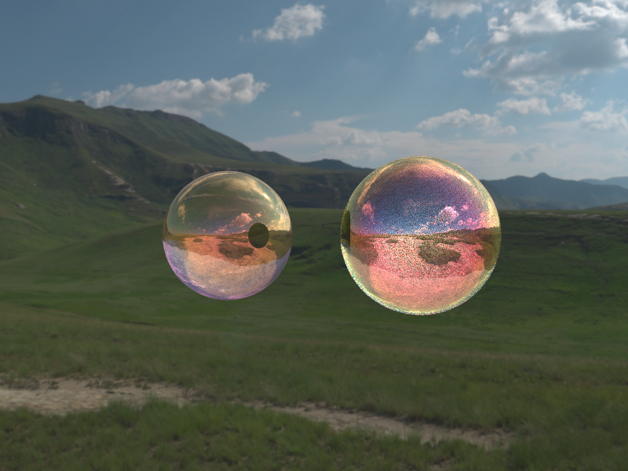
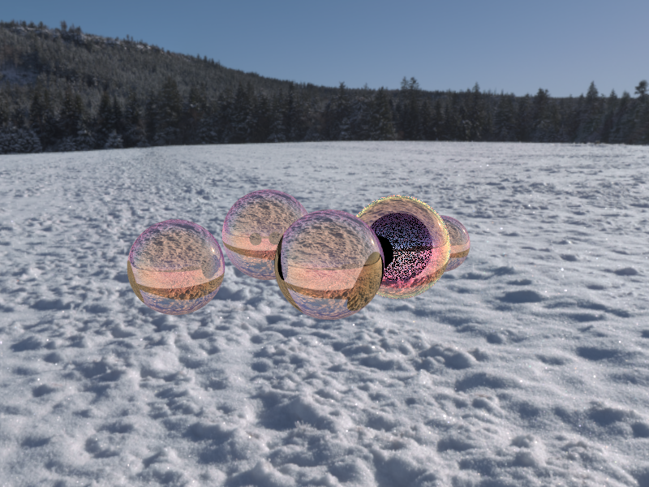

# Spectra Final Project Page
> Authors: Viktor Mooren, Ahsvin Verma, Curtis Hu, Toben Main

[Webpage - https://cal-cs184-student.github.io/sp25-project-banana/final.html](https://cal-cs184-student.github.io/sp25-project-banana/final.html)

[Video - https://youtu.be/PE2Gt93EPio](https://youtu.be/PE2Gt93EPio)

[Slides - https://docs.google.com/presentation/d/1gtzun76RyVqlP6JTpcr81-nIjR_kHExnm26jVj8ftGw/edit?usp=sharing](https://docs.google.com/presentation/d/1gtzun76RyVqlP6JTpcr81-nIjR_kHExnm26jVj8ftGw/edit?usp=sharing)

## Abstract
In Spectra, we set out to model the iridescent effects seen in thin films and soap bubbles by simulating the physical behavior of light at the wavelength level. To achieve this, we extended our existing ray tracer from Homework 3 to support spectral rendering, enabling it to process and track light across a continuous range of wavelengths instead of traditional RGB values. Spectral ray tracing is more physically accurate because light in the real world is composed of a spectrum of wavelengths, not discrete red, green, and blue components. This allowed us to more easily capture wavelength-dependent interference patterns and color shifts that are characteristic of thin films. We implemented models for thin-film interference based on Fresnel equations and optical path differences, integrating them into the ray tracing pipeline. The final result is a physically informed renderer capable of producing realistic and visually rich simulations of phenomena like bubbles, oil slicks, and other interference-based effects.

## Technical Approach
Part 1: Spectral Ray Tracing:

The SpectralBSDF is the core of the spectral extension. It moves beyond treating light as a single RGB triplet. The fundamental idea here is that material properties (reflectance, transmittance, refractive index) can vary with the wavelength of light. Therefore, when light interacts with a surface, the amount reflected or transmitted, and even the direction of transmission, can be different for each wavelength. So, our goal is to work with the spectral power distribution of light, instead of an RGB representation, to build a new ray tracer to accomplish the aforementioned tasks.

Since dealing with continuous spectral distributions is computationally expensive, a sampling approach is used. The sample_lambda function selects a discrete set of wavelengths to represent the incident light's spectrum. The current implementation uses a simplified method, picking a random wavelength within the visible range and then selecting a small band of nearby wavelengths. This is called "hero sampling" and is an attempt to capture some local spectral characteristics with a limited number of samples. While taking random samples of the wavelength every time would work, it requires a lot more samples to converge. Instead, we use hero sampling to decrease noise while remaining unbiased.

Because the final output of a typical display is in RGB, the sampled wavelengths need to be converted. We found data on the CIE XYZ color space to translate our wavelength into this needed conversion. Each sampled wavelength is converted to its corresponding XYZ (and then RGB, which we also found a matrix for online) value, representing how a human observer would perceive that single wavelength. By processing a set of sampled wavelengths and averaging their RGB contributions, we get an approximate RGB representation of the spectrally varying light interaction. In our new BSDF's f() function, we now introduce this converted wavelength value as our intensity of light, which is then scaled by reflectance or transmittance variables.

We should also note our decision to write our spectral segment as a BSDF instead of processing wavelengths throughout the rendering pipeline and doing an RGB conversion at the end. While this approach is viable and something that we saw in Dawson's paper on spectral ray tracing, we found a bit of difficulty trying to implement it. We figured we'd have to create a wavelength attribute for our rays and then find a way to propogate it throughout our system, but then we thought it would be difficult to work with these properties throughout our illuminance portions of the ray tracer. By calculating change in light at the surface of the object, we prevent having to rewrite the entire rendering pipeline to introduce spectral rendering, while also allowing us to maintain the properties of spectral ray tracing and additionally work within the realms of reflectance, transmittance, and refraction to produce thin films, bubbles, etc. Intuitively, we also liked the idea that the materials themselves carry the properties of having certain wavelengths of light associated with them, and they're also responsible for the way light interacts with them.

Part 2: Thin Films:

Thin-film interference arises due to multiple reflections inside the film (like in a bubble). The idea is that when a ray hits the surface of a bubble, part of it bounces and part enters through the film. Then, inside the film, the ray partially bounces and partially enters through the bubble/other surface that the thin film covers. This interference on the two bounced portions leads to spectacular colors. 

We calculate this reflection interference using Airy reflectance. Refraction indices n1, n2, and n3 represent air, the thin film, and the base material respectively. Given an incident angle θ_1, we compute the transmission angles using Snell’s law: 

$$
\sin\theta_2 = \frac{n_1}{n_2} \sin\theta_1
$$

$$
\cos\theta_2 = \sqrt{1 - \sin^2\theta_2}
$$

$$
\sin\theta_3 = \frac{n_2}{n_3} \sin\theta_2
$$

$$
\cos\theta_3 = \sqrt{1 - \sin^2\theta_3}
$$

These equations dictate how the light bends as it enters and exits the thin films.

As mentioned previously, we also have to account for the amount of waves that reflect vs. refract (which rays reflect and which ones proceed through the thin film). These are given by Fresnel's coeffecient equations:

$$
r_{12} = \frac{n_1 \cos\theta_1 - n_2 \cos\theta_2}{n_1 \cos\theta_1 + n_2 \cos\theta_2}
$$

$$
r_{23} = \frac{n_2 \cos\theta_2 - n_3 \cos\theta_3}{n_2 \cos\theta_2 + n_3 \cos\theta_3}
$$

Which are coeffecients that tell us just how much of the light is reflected. This dictates to us whether we should have a ray bounce off of our bubble object or proceed to the next layer (where it may then bounce or proceed once again). From here, we shift the wavelength of our light ray to account for the aforementioned interference of the rays that bounce. This is denoted by the following equation:

$$
\phi = \frac{4\pi n_2 d \cos\theta_2}{\lambda}
$$

Which gives us how much the phase of our wave has shifted due to this transformation. Lastly, we use airy reflectance, what we brought up earlier, to check whether this interference is going to be constructive or destructive. Meaning, how strong is this reflection going to be, a mirror, or maybe the reflection isn't strong at all. Airy reflectance puts everything we previously talked about to form just how much reflectance is going on:

$$
R(\lambda, \theta_1, d) = \frac{r_{12}^2 + r_{23}^2 + 2 r_{12} r_{23} \cos(\phi)}{1 + r_{12}^2 r_{23}^2 - 2 r_{12} r_{23} \cos(\phi)}
$$

## Conclusion

When doing this project, we learned not to invent the wheel. Initially, we considered either learning a new toolkit (PBRT) or craft a new ray tracer to create bubble/thin film rendering, but then we realized we had a good portion of the work already laid out for us in our homework 3. Utilizing resources and information other people have already tested and tried also came in handy. We were able to find various sources on XYZ and RGB conversions, as well as intricate details like the value of hero sampling, and implemented a new RNG for our hero sampling. We also used the same ray tracer as we did for our homework 3, so we were able to reuse the code for our ray tracer and our ray-object intersection functions.

There were a lot of issues, but we were able to get a working spectral implementation, albeit with higher general reflection and smaller transmission than we would've liked.

## Results

## Video

## References

### Contributions
#### Curtis Hu
Documentation, Spectral Ray Tracer
#### Viktor Mooren
Putting video together
#### Ashvin Verma
Thin film rendering, images
#### Toby Main
Website, Presentation slides, Spectral Ray Tracer 

Spectral Primary Decomposition
for Rendering with sRGB Reflectance
Ian Mallett1
and Cem Yuksel

https://graphics.geometrian.com/research/spectral-primaries.html

Hero Wavelength Spectral Sampling
A. Wilkie, S. Nawaz, M. Droske, A. Weidlich, J. Hanika

https://cgg.mff.cuni.cz/publications/hero-wavelength-spectral-sampling/?utm_source=chatgpt.com

http://www.brucelindbloom.com/index.html?Eqn_RGB_XYZ_Matrix.html

