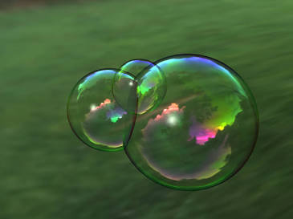
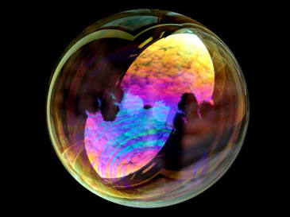

# __Spectra__
> __Curtis Hu, Ashvin Verma, Toben Main, Viktor Mooren__

## __Summary__
This project aims to develop a __physically-based spectral rendering system__ capable of accurately simulating __thin-film interference effects__, such as those seen in __soap bubbles__, __oil slicks__, and similar __iridescent phenomena__ on the surface of opaque bodies. The system will address the challenges of modeling __wavelength-dependent light transport__ and __spectral interference__, exploring solutions by extending an existing __ray tracer__.

## __Problem Description__
Traditional __RGB rendering__ (using only __red__, __green__, and __blue__ channels as color components), while wildly successful in computer graphics in general, has fundamental limitations in representing phenomena where there is a shift in the __spectral power distributions__. In a standard renderer, each __RGB color channel__ represents (possible combinations of) a broad band of wavelengths, so fine spectral interactions are averaged out. This means phenomena like __thin-film interference__—where certain wavelengths reinforce or cancel out due to path length differences—cannot be replicated with simple __RGB approximations__. In fact, standard __RGB rendering__ cannot accurately represent highly __wavelength-dependent phenomena__ such as thin-film interference. The result is that an __RGB-based renderer__ would fail to produce the distinctive rainbow shimmer on a __soap bubble__, the shifting colors of an __oil slick__ or the __iridisensce__ of a leather couch, because it lacks the __spectral resolution__ to model how different wavelengths interfere.

__Spectral rendering__ is important for simulating these physical phenomena because it treats light as a __spectrum of wavelengths__ rather than just three values. A classic example is a __soap bubble__: it shows __iridescent colors__ that change with viewing angle and light direction due to __thin-film interference__. Light reflecting off the thin soap film undergoes interference between the reflections from the front and back surfaces of the film, leading to vivid colors that depend on the film’s thickness and the incoming light’s wavelength and angle. Similarly, __oil on water__ displays rainbow patches for the same reason. Capturing these effects requires computing physics at the __wavelength level__. __Dispersion__ is another __wavelength-dependent effect__, where materials like prisms or certain glass split white light into a spectrum of colors. Both __dispersion__ and __thin-film interference__ are beyond the reach of an __RGB renderer__ but can be handled by a __spectral renderer__. The core challenge in this project is to simulate both __dispersion__ and __thin-film interference__ within a rendering system by using accurate __wavelength sampling__ and __interference modeling__. This involves extending the __light transport simulation__ to sample many wavelengths (or a continuous representation of spectrum) and computing interference based on phase differences for those wavelengths. Integrating this into a renderer will require careful design to manage the additional computational cost. We are mainly trying to modify our existing __ray tracer__ from HW3, but are seeing that we may need to modify its guts to add these features. The decision will be based on feasibility and which approach allows easier integration of __spectral physics__. Either way, the goal is to overcome the __RGB limitations__ by incorporating true __spectral light transport__ and __thin-film interference modeling__ into the rendering pipeline.

## __Goals and Deliverables__
1. __MVP (What we plan to deliver):__  
- __Spectral Rendering Engine__: A functioning __spectral renderer__ capable of producing images of __soap bubbles__ (or similar thin films) with realistic __thin-film interference patterns__. This renderer will use physically accurate __spectral sampling of light__, rather than __RGB__, as the foundation.  
- __Spectral Light Representation__: Implement a method for representing and sampling __light spectra__ instead of just three __RGB channels__. This could involve __Monte Carlo sampling__ of individual wavelengths across the visible spectrum or using a fixed __spectral basis__. The aim is to ensure the renderer can handle continuous wavelength data for light sources and surfaces.  
- __Thin-Film Interference Model__: Implement __thin-film interference effects__ using __physics-based optics models__. This includes using __Fresnel equations__ for reflectance at interfaces and accounting for the __phase shifts__ that occur when light waves reflect within a thin film layer. By combining reflections from the top and bottom surfaces of a film with the appropriate phase difference, the renderer will simulate __constructive and destructive interference__ at different wavelengths.  
- __Rendered Demonstrations__: Output a set of example images demonstrating the effects. For instance, render a scene with a __soap bubble__ under various lighting and viewing angles, showing the changing __iridescent colors__. These images will serve as validation that our __spectral rendering__ and __thin-film interference model__ are working correctly and producing visually convincing results.  

2. __Stretch Goal (What we hope to deliver):__  
- __Extended Phenomena__: Extend the __spectral renderer__ to handle additional phenomena beyond __soap bubbles__. Examples include rendering __oil slicks on water__ (another thin-film case with spatially varying thickness), __prism dispersion__ (splitting white light into a spectrum), or __rainbow caustics__ through dispersive optics or a thin film on a piece of leather causing __iridisensce__. This will demonstrate the generality of our __spectral approach__ for various __wavelength-dependent effects__.  
- __Spectral Sampling Strategies__: Evaluate and compare different __spectral sampling models__ for efficiency and accuracy. For instance, we might compare straightforward __Monte Carlo sampling__ of wavelengths versus using a precomputed __spectral basis__ or fewer “hero” wavelengths to approximate the full spectrum. This analysis will help determine the trade-offs in image quality versus performance for different __spectral rendering techniques__.  
- __White-Light Caustics__: Show support for rendering __caustics__ and __dispersion__ under __white light illumination__. For example, a glass object or prism that creates a spectrum of colors on a surface (a __dispersive caustic__) would be an impressive demonstration. Our system should be able to simulate how a single __white light beam__ can produce a multi-colored pattern after passing through or reflecting off a __dispersive material__.  
- __Real-World Spectral Data Integration__: Increase realism by using real __spectral data__. This could include using standard __illumination spectra__ (such as the __CIE D65 daylight spectrum__) instead of an idealized white light, or incorporating measured __thin-film thickness maps__ or measured __index-of-refraction spectra__ for materials. By plugging in real-world data, we can make our rendered results more physically accurate and directly comparable to real photographs.  
- __Performance Analysis and Optimization__: Perform a basic __performance analysis__ of our __spectral renderer__ and implement __acceleration techniques__ to make it more practical. Potential optimizations include __importance sampling of wavelengths__ (focusing samples on wavelengths that contribute most to the final image), __caching reusable spectral results__ (for example, caching interference results for certain thicknesses or materials), or __adaptive sampling__ where the renderer allocates more samples to regions with high spectral variation. We will document how these techniques improve rendering times or reduce noise, and ensure that the enhanced renderer is still delivering physically accurate results.  

## __Schedule__

- __Week 1: Research & Planning__ – Investigate the physics and math of __thin-film interference__ and __dispersion__ in detail. This involves reading physics literature on thin films (to understand equations for interference based on film thickness and refractive indices) and reviewing existing work on __spectral rendering__ in graphics. We will also survey existing __spectral rendering engines__ or frameworks (for example, check if __PBRT__ or other open-source __ray tracers__ have spectral modes) to gauge what solutions already exist. By the end of this week, we aim to have a clear understanding of the theoretical models and a plan for the renderer’s architecture.  
- __Week 2: Setup & Spectral Foundation__ – Decide on the renderer codebase. We will choose whether to extend an existing __ray tracer__ (such as __PBRT-v4__ or the course-provided __ray tracing framework__) or start building a new one tailored for __spectral rendering__. Once decided, begin implementation of the __spectral framework__: define how __spectra__ are represented in the code (e.g., as an array of sampled wavelengths, or an analytic function, or using a small set of basis functions). Implement the ability to sample random wavelengths for rays (if using __Monte Carlo spectral sampling__) and propagate those through the rendering pipeline. By the end of Week 2, we expect to have basic non-interference __spectral rendering__ working (e.g., rendering a scene with __dispersion__ or just showing that a __prism__ splits light correctly, to verify our __spectral sampling__ works).  
- __Week 3: Thin-Film Interference Implementation__ – Integrate a __thin-film interference model__ into the renderer. This includes coding the __Fresnel reflectance__ for at least two-layer interfaces (air/film and film/substrate) and computing the __phase shifts__ due to the film’s thickness for each wavelength. We will likely start with a simple scenario (a single thin film on a surface) and assume uniform thickness, then possibly extend to spatially varying thickness. After implementing the interference calculations, render test scenes focused on __soap bubbles__ or thin-film plates. We’ll experiment with different film thicknesses and view angles to ensure the interference colors appear as expected. By the end of this week, we should have initial images of a __spectral soap bubble__ with noticeable __iridescent coloring__. Any mismatches or physical inaccuracies will be debugged during this stage.  
- __Week 4: Optimization and Extensions__ – Refine the renderer for quality and speed. This includes optimizing __spectral integration__ (for example, reducing noise in the images by smarter __wavelength sampling__) and ensuring that adding __spectral effects__ hasn’t made the render unbearably slow. We will also, time permitting, implement one or two aspirational features: for instance, try rendering an __oil slick scene__ or a __prism with caustics__ to see our renderer handle those cases. We’ll spend some time analyzing performance (comparing render times with different numbers of wavelength samples, etc.) and perhaps implement an __importance sampling strategy__ if noise is an issue. The final part of the week is dedicated to preparing the final demo, images, and presentation. We will create side-by-side comparisons (if possible) of __RGB vs spectral renderings__ to highlight the improvements, and assemble our findings into a coherent presentation for the class. Since  members of our team have experience in GPU programming, we might write kernels and accelerate our ray tracer.

## __Resources__

- https://larswander.com/writing/spectral-ray-tracing/
- __EFFICIENT SPECTRAL RENDERING ON THE GPU FOR PREDICTIVE RENDERING__ David Murray,1 Alban Fichet,1 and Romain Pacanowski1,2 Institut d’Optique Graduate School, CNRS INRIA
- https://www.dgp.toronto.edu/~nmorris/CSC2530/Project/morris.pdf
- https://www-users.cse.umn.edu/~gmeyer/papers/gondek-meyer-siggraph-1994.pdf

__Computing Platforms__: __MacOS__, __Windows 11__

__Starter Code__: We are considering using __PBRT-v3/v4__ or the __CS184 provided ray tracing base code__ as a starting point. __PBRT v4__, for instance, already supports __spectral rendering modes__, which could save time – we would then focus
The project will be implemented in C++ for performance and to allow integration with existing graphics code. If we base our work on PBRT or another renderer, we will work within that C++ framework. We might also use GLSL or CUDA for any GPU-accelerated portions or shader-based experiments (for instance, if we attempt a real-time thin-film shader as a stretch goal). The choice of platform will be finalized in Week 2 when we decide on extending vs. writing from scratch.

We plan to use our personal computers for development and testing. Some team members have a laptop/desktop with a capable GPU (e.g., a NVIDIA graphics card) which will help with faster rendering and potential GPU implementations for all the team members to use.

