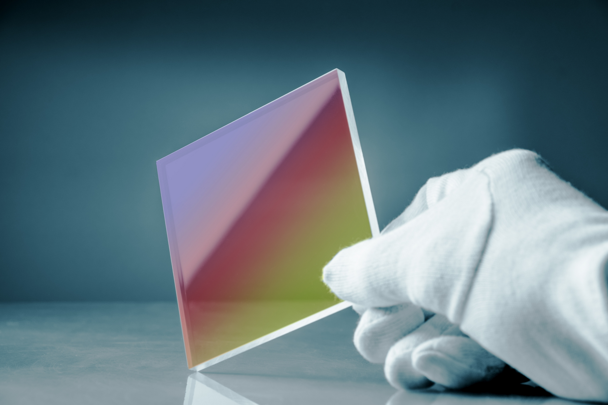

# Spectra Milestone
> Viktor Mooren, Toben Main, Curtis Hu, Ashvin Verma

[insert video here]
[insert slides here]

## Theory

Spectral ray tracing relies on treating rays with their wave-like properties to create effects like thin-films, rainbows, and oil spills.
The underlying theory is multiple parts.

Fundamentally, we are treating every material as "glass" except every material has a unique Spectral Power Distribution.
In layman's terms, the emitted light is composed of a different variation of different wavelengths.
In nature, this is a continuous distribution such as in white light (black body radiation).
In our case, we'll rely on simpler uniform distribution and a data binned distribution.

Thin-films seems to effectively change this SPD with its varying interference patterns. SPD is importance as we'll deduce the RGB values using it.

Using the unique SPD of the material, we'll calculate the corresponding radiance in a series of steps outlined in the paper from Dawson below. We can essentially model the BSDF similar to glass but with sampling over the wavelengths to approximate the integral needed for conversion into RGB colors. More is discussed in the <a href="/theory.html">Theory Tab</a>

## Progress
The beginnings of the project was simply reprogramming how homework 3.
To achieve spectral ray tracing we would need to define a new kind of BSDF that doesn't exist in the existing code.
The functionality is most similar to the glass BSDF that exists.

We had to learn Blender and create our own DAE files. 
This simple task proved quite difficult since all the DAE files provided relied on Blender V2, which is drastically different. HW3 is mostly legacy code.
We had to find some workarounds to the incompatibility.
Specifically, the problem of **triangulation** of the mesh.
The legacy code only parses the mesh as a N-polygonal mesh which cannot be exported or created by Blender V4!
Blender automatically triangulates all meshes and exports this in a triangular mesh, which doesn't generalize to N-polygons.
This is immensely troublesome. 
As a temporary workaround, we handwrote the DAE files by manually enscribing all the vertices.

In addition, we had to inscribe the new material properties such that Collada would be able to read these properties,
specfically the BSDF, reflectance, transmittance, etc.
This also required tracing through the filesystem and hunting down problematic parts of the code.
We needed the code to be able to read and process these new values from the DAE file.

We've been struggling to integrate the new theory with the pre-existing code. For example, one of the problems is how the "transmittance" or "reflectance" properties work with the current radiance? It seems to be too bright now. How do we get a transparent quality? Another problem is getting `at_least_one_bounce_radiance` to work with the transmitted and reflective rays. Another problem is how we'll store and manage multiple index of refractions as the ray traverses multiple materials. We all have different ideas on how to solve these problems and it is a bit of a clas right now.

## Results

- We were able to generate the new kinds of DAE files.
- We were successfully able to rewrite the codebase to process the new DAE files and read in new material properties.
- We were able to run the code to successfully read in `zero_bounce_illumination` and `one_bounce_illumination` for only the reflective rays of the `SpectralBSDF`

## Reflection
We are hoping to complete the theory part of the code as soon as possible and get a working baseline case.
Specifically, the flat surface thin film for now. 

I'm hoping we can also improve the communication for the team.
I'm really hoping that they aren't afraid to ask questions and treat each others as peers rather than competitors.

In addition, hopefully we can develop a stronger communication and sense of direction.
We don't exactly the most even distribution of workload.
We would volunteer an even workload but what ends up happening is that some do more than others (which is perhaps natural as things need to get done and some will need to pull the slack of others).

### References

- https://www.dawsondo.net/projects/spectral
- https://destinyluong.github.io/CS184Final/
- https://dl.icdst.org/pdfs/files3/610aca40599a0f42ecaa2b20bb95850c.pdf
- https://jcgt.org/published/0002/02/01/
